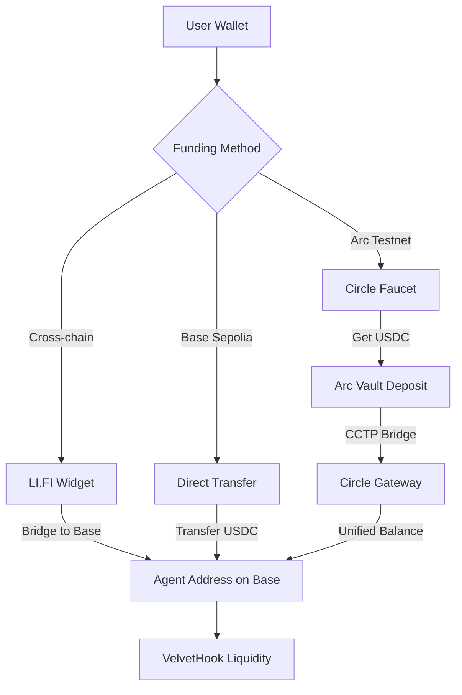
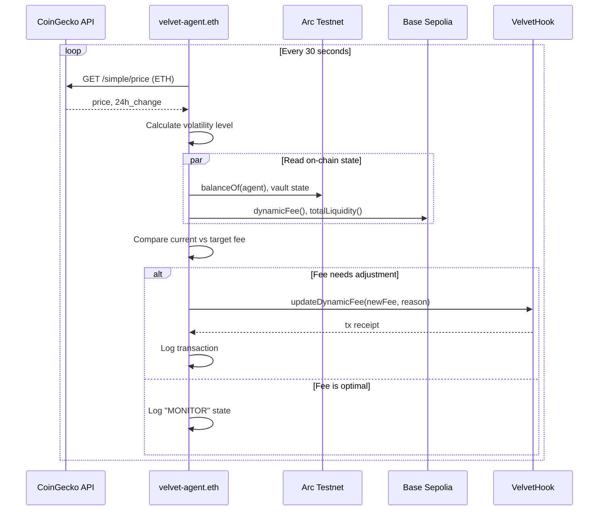
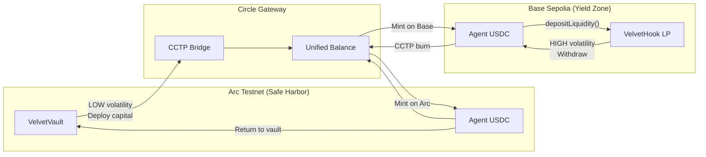

# Velvet Arc - Architecture

## System Overview

Velvet Arc is an autonomous treasury agent that manages USDC across Circle Arc (safe harbor) and Base (yield zone) by dynamically adjusting Uniswap V4 hook fees based on real ETH volatility.

```
┌─────────────────────────────────────────────────────────────────────────────────┐
│                              VELVET ARC ARCHITECTURE                             │
└─────────────────────────────────────────────────────────────────────────────────┘

                              ┌─────────────────┐
                              │   USER WALLET   │
                              └────────┬────────┘
                                       │
                   ┌───────────────────┼───────────────────┐
                   │                   │                   │
                   ▼                   ▼                   ▼
        ┌──────────────────┐ ┌─────────────────┐ ┌─────────────────┐
        │   LI.FI Widget   │ │  Circle Faucet  │ │  Direct Transfer│
        │  (Any Chain)     │ │  (Testnet USDC) │ │  (Base Sepolia) │
        └────────┬─────────┘ └────────┬────────┘ └────────┬────────┘
                 │                    │                   │
                 │                    ▼                   │
                 │         ┌──────────────────┐           │
                 │         │   ARC TESTNET    │           │
                 │         │   (Chain 5042002)│           │
                 │         │                  │           │
                 │         │  ┌────────────┐  │           │
                 │         │  │VelvetVault │  │           │
                 │         │  │  (USDC)    │  │           │
                 │         │  └─────┬──────┘  │           │
                 │         │        │         │           │
                 │         └────────┼─────────┘           │
                 │                  │                     │
                 │         Circle Gateway / CCTP          │
                 │                  │                     │
                 │                  ▼                     │
                 │         ┌──────────────────┐           │
                 └────────►│  BASE SEPOLIA    │◄──────────┘
                           │  (Chain 84532)   │
                           │                  │
                           │  ┌────────────┐  │
                           │  │VelvetHook  │  │
                           │  │Uniswap V4  │  │
                           │  │Dynamic Fee │  │
                           │  └─────┬──────┘  │
                           │        │         │
                           └────────┼─────────┘
                                    │
                                    ▼
                    ┌───────────────────────────────┐
                    │     velvet-agent.eth          │
                    │    (Agent Backend API)        │
                    │                               │
                    │  ┌─────────────────────────┐  │
                    │  │   Every ~30 seconds:    │  │
                    │  │                         │  │
                    │  │  1. Fetch ETH price     │  │
                    │  │     from CoinGecko      │  │
                    │  │                         │  │
                    │  │  2. Read on-chain:      │  │
                    │  │     - Hook dynamicFee   │  │
                    │  │     - USDC balances     │  │
                    │  │     - Vault state       │  │
                    │  │                         │  │
                    │  │  3. Calculate volatility│  │
                    │  │     LOW/MED/HIGH/EXTREME│  │
                    │  │                         │  │
                    │  │  4. Decide target fee   │  │
                    │  │     LOW  → 500 (0.05%)  │  │
                    │  │     MED  → 3000 (0.30%) │  │
                    │  │     HIGH → 10000 (1.0%) │  │
                    │  │                         │  │
                    │  │  5. Execute tx if needed│  │
                    │  │     updateDynamicFee()  │  │
                    │  └─────────────────────────┘  │
                    └───────────────────────────────┘
```

## Data Flow Diagrams

### 1. User Funding Flow



### 2. Agent Decision Loop



### 3. Capital Flow: Arc ↔ Base



## Component Details

### Smart Contracts

| Contract | Chain | Address | Purpose |
|----------|-------|---------|---------|
| VelvetVault | Arc Testnet | `0xC4a486Ef5dce0655983F7aF31682E1AE107995dB` | USDC vault, share tokens, bridge orchestration |
| VelvetHook | Base Sepolia | `0x9D5Ed0F872f95808EaFf9F709cA61db06Dc520d2` | Uniswap V4 hook, dynamic fees, liquidity |

### Agent Backend (`/api/agent`)

```
┌──────────────────────────────────────────────────────────────┐
│                     AGENT API ROUTE                          │
├──────────────────────────────────────────────────────────────┤
│                                                              │
│  GET /api/agent                                              │
│  └── Returns current agent state                             │
│                                                              │
│  POST /api/agent { action: "..." }                          │
│  ├── "start"    → Enable autonomous mode                    │
│  ├── "stop"     → Disable autonomous mode                   │
│  ├── "step"     → Run single iteration                      │
│  ├── "reset"    → Clear state                               │
│  ├── "simulate_high_volatility"   → Demo: trigger 1% fee    │
│  ├── "simulate_low_volatility"    → Demo: trigger 0.05% fee │
│  ├── "simulate_extreme_volatility"→ Demo: circuit breaker   │
│  └── "deploy_liquidity"           → Manual LP deployment    │
│                                                              │
└──────────────────────────────────────────────────────────────┘
```

### Volatility → Fee Mapping

| Volatility Level | Price Change (24h) | Target Fee | Strategy |
|------------------|-------------------|------------|----------|
| LOW | < 3% | 500 (0.05%) | Attract volume with low fees |
| MEDIUM | 3% - 7% | 3000 (0.30%) | Balanced fee for steady returns |
| HIGH | 7% - 10% | 10000 (1.00%) | Capture premium from chaos |
| EXTREME | > 10% | 10000 (1.00%) | Circuit breaker, retreat to Arc |

### Capital States

| State | Condition | Visual |
|-------|-----------|--------|
| `PROTECTED` | Majority USDC on Arc | Silver/white orb |
| `EARNING` | Majority USDC on Base | Green/blue/purple orb |
| `CIRCUIT_BREAKER` | Volatility > 10% | Red pulsing orb |

## Tech Stack

```
┌─────────────────────────────────────────────────────────────┐
│                        FRONTEND                              │
├─────────────────────────────────────────────────────────────┤
│  Next.js 14          │  App router, API routes              │
│  React Three Fiber   │  3D orb visualization                │
│  Framer Motion       │  Animations                          │
│  Tailwind CSS        │  Glassmorphism dark theme            │
│  wagmi + viem        │  Wallet connection, contract calls   │
│  RainbowKit          │  Wallet UI                           │
│  @lifi/widget        │  Cross-chain deposits                │
└─────────────────────────────────────────────────────────────┘

┌─────────────────────────────────────────────────────────────┐
│                      SMART CONTRACTS                         │
├─────────────────────────────────────────────────────────────┤
│  Solidity 0.8.26     │  Contract language                   │
│  Foundry             │  Build, test, deploy                 │
│  Uniswap V4 Core     │  Hook interface                      │
│  OpenZeppelin        │  ERC20, security patterns            │
└─────────────────────────────────────────────────────────────┘

┌─────────────────────────────────────────────────────────────┐
│                      EXTERNAL APIS                           │
├─────────────────────────────────────────────────────────────┤
│  CoinGecko           │  ETH price, 24h change               │
│  Arc RPC             │  https://rpc.testnet.arc.network     │
│  Base Sepolia RPC    │  Public node                         │
└─────────────────────────────────────────────────────────────┘
```

## Security Considerations

1. **Private Key**: Agent wallet key stored in `PRIVATE_KEY` env var
2. **Gas Management**: Agent checks ETH balance before tx, requires > 0.0001 ETH
3. **Rate Limiting**: 30-second loop prevents spam
4. **Error Handling**: All on-chain reads wrapped with `.catch()` fallbacks
5. **Circuit Breaker**: Extreme volatility triggers protective mode

## File Structure

```
src/
├── app/
│   ├── api/agent/route.ts    # Agent backend API
│   ├── app/page.tsx          # Main dashboard
│   └── page.tsx              # Landing page
├── components/
│   ├── VelvetOrb.tsx         # 3D orb (volatility colors)
│   └── TerminalLogs.tsx      # Real-time log display
├── hooks/
│   ├── useAgentAPI.ts        # Agent state management
│   ├── useVelvetStore.ts     # Zustand store
│   └── useContracts.ts       # Contract hooks
└── lib/
    └── wagmi-config.ts       # Chain + contract config
```
